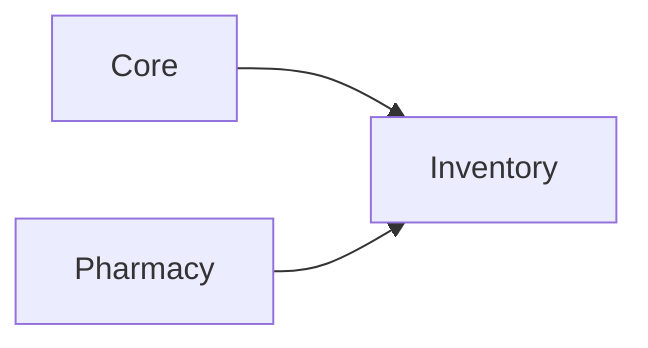

# Inventory module

**In one sentence:** The Inventory module manages central dispensary stock, procurement (purchase orders), ward/department requisitions, inter-branch stock transfers, and stock adjustments so the hospital can track, move, and replenish non-pharmacy supplies and equipment alongside pharmacy-mediated items.

## Why this module exists

Running a hospital requires more than just medicines. Supplies, consumables, and equipment also need to be tracked: where they are, who ordered them, when more should be ordered, and where they were sent. Without a dedicated inventory system, those workflows scatter across spreadsheets, paper forms, and silent shortages.

This module brings dispensary and ward-level stock into a single ledger, connects procurement to stock-on-hand, and tracks goods as they move between branches, departments, and the pharmacy.

## Where Inventory fits in FlowRise

- **Depends on Core** for branches, departments, units, and user/permission foundations.
- **Depends on Pharmacy** for the `Medication` catalog — inventory items can reference medications via `medication_id` for pharmacy-integrated stock.
- Provides its own stock ledger (`StockBalance`, `InventoryTransaction`) separate from Pharmacy's `StockItem`/`StockMovement`.
- Integrates with Pharmacy's `StockProviderContract` so inventory issues to pharmacy update both ledgers atomically.

## What you can do with it

- Maintain an **inventory item catalog** (supplies, consumables, equipment, general items) with optional medication linking.
- Track **stock balances** across dispensary, ward, and in-transit locations per branch.
- Create and manage **purchase orders** — from draft through submission, partial/full receipt, and close.
- Record **goods received notes** against purchase orders with lot numbers, expiry dates, and unit prices.
- Create **ward/department requisitions** — request, approve, decline, issue, and close with partial issuance.
- Run **inter-branch stock transfers** — create, ship, partially receive, and close with in-transit tracking.
- Perform **stock adjustments** to correct on-hand quantities.
- View the **complete inventory ledger** — every increment, decrement, and transfer recorded as transactions.
- **Print documents** — Goods Received Notes (GRN), Requisition Vouchers, Stock Transfer Notes, Adjustment Vouchers, and Stock Cards as PDF.
- Toggle features on/off: pharmacy procurement integration, ward requisitions, inter-branch transfers.

## How it works (simple)

1. **Set up** your inventory catalog (items, suppliers, units, branches).
2. **Procure stock**: Create a purchase order → submit to supplier → receive goods → stock appears in dispensary.
3. **Fulfill requests**: Ward staff request items via requisition → supervisor approves → dispensary issues stock.
4. **Move stock between sites**: Source branch ships → in-transit tracking → destination branch receives.
5. **Reconcile**: Run stock adjustments when physical count differs from system, review the transaction ledger.

## What is inside this folder

| Path | Purpose |
|------|---------|
| `app/Models/` | Inventory items, stock balances, ledger transactions, POs, requisitions, transfers, suppliers. |
| `app/Classes/Services/` | Business logic: stock ledger, document numbering, PO management, requisitions, transfers, adjustments, issue-to-ward, issue-to-pharmacy. |
| `app/Filament/Clusters/Inventory/` | Admin UI: cluster, 7 Filament resources, schemas, tables, pages. |
| `app/Enums/` | Item categories, stock location types, transaction types, status enums for POs, requisitions, transfers. |
| `app/Policies/` | Authorization rules for each model. |
| `app/Providers/` | Module boot/register logic. |
| `database/migrations/` | 13 schema migrations for all inventory tables. |
| `resources/views/pdf/` | Printable PDF document templates (GRN, vouchers, notes, stock card). |
| `database/factories/` | Model factories for testing. |
| `tests/` | Feature tests for core services and PDF generation. |

## Dependencies

- `flowrise-hms/core`
- `flowrise-hms/pharmacy` (optional via feature toggle `inventory_pharmacy_procurement`)

See [module status](../../docs/shared/module-status.md) for rollout state.

## Further reading

- **Developer guide:** [Inventory Developer Guide](docs/developer-guide.md)
- Implementation plan: [docs/superpowers/plans/2026-07-09-inventory-module-implementation.md](../../docs/superpowers/plans/2026-07-09-inventory-module-implementation.md)
- Design spec: [docs/superpowers/specs/2026-07-09-inventory-module-design.md](../../docs/superpowers/specs/2026-07-09-inventory-module-design.md)
- Project-level docs: [docs/README.md](../../docs/README.md)

## For developers

- **Namespace:** `Modules\Inventory\...`
- **Service provider:** `Modules\Inventory\Providers\InventoryServiceProvider`
- **Filament cluster:** `Modules\Inventory\App\Filament\Clusters\Inventory\InventoryCluster`
- **Plugin:** `Modules\Inventory\App\Filament\InventoryPlugin` (registered in `config/app.php` or panel provider)
- **Stock contract bridge:** `StockProviderContract::incrementWithReference()` is implemented by `StockService` (Pharmacy) and called from `IssueToPharmacyService`
- **Feature toggles:** Managed via `ManageFeatureSettings` in Core; checked with `Feature::isEnabled('inventory_ward_requisitions')` etc.
- **Document numbering:** Automatic number generation for POs (`PO-...`), requisitions (`REQ-...`), transfers (`TRF-...`) via `DocumentNumberingService`
- **Running tests:** `php artisan test --filter='Inventory'` or `php artisan test Modules/Inventory/tests/`
