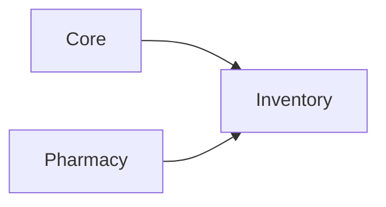

# Inventory module

> **Status:** Complete — see [Module Status](../../docs/shared/module-status.md).

**In one sentence:** The Inventory module manages central dispensary stock, procurement (purchase orders), ward/department requisitions, inter-branch stock transfers, and stock adjustments so the hospital can track, move, and replenish non-pharmacy supplies and equipment alongside pharmacy-mediated items.

## Why this module exists

Running a hospital requires more than just medicines. Supplies, consumables, and equipment also need to be tracked: where they are, who ordered them, when more should be ordered, and where they were sent. Without a dedicated inventory system, those workflows scatter across spreadsheets, paper forms, and silent shortages.

This module brings dispensary and ward-level stock into a single ledger, connects procurement to stock-on-hand, and tracks goods as they move between branches, departments, and the pharmacy.

## Where Inventory fits in FlowRise

- **Depends on Core** for branches, departments, units, and user/permission foundations.
- **Depends on Pharmacy** for the `Medication` catalog — inventory items can reference medications via `medication_id` for pharmacy-integrated stock.
- Provides its own stock ledger (`StockBalance`, `InventoryTransaction`) separate from Pharmacy's `StockItem`/`StockMovement`.
- Integrates with Pharmacy via Core's `StockProviderContract` (bound to Pharmacy `StockService`) so inventory issues to pharmacy update both ledgers atomically.

## What you can do with it

### Built (services + Filament)

- Maintain an **inventory item catalog** (supplies, consumables, equipment, general items) with optional medication linking and initial dispensary stock on create.
- Track **stock balances** across dispensary, ward, and in-transit locations per branch, including **lot tracking** with **FEFO** ledger decrement.
- Create and manage **purchase orders** — draft, submit, receive (partial quantities via modal), close.
- **Approve, decline, issue, or close** ward/department requisitions from Filament (issue on View → Items; **Fulfill items** shortcut on list/widget).
- Run **inter-branch stock transfers** — create, ship, receive (partial), close with in-transit write-off.
- **Adjust stock** on any balance (Stock Balances → View → Adjust stock).
- View the **complete inventory ledger** and **analytics report** (8 chart widgets, CSV export).
- **Print documents** — GRN, Requisition Vouchers, Stock Transfer Notes, Adjustment Vouchers, and Stock Cards as PDF.
- **My ward requests** dashboard widget with slide-over create/view and fulfill shortcut.
- **Pharmacy → Stock Items → Request from central store** for medication-linked replenishment.
- **Auto-reorder draft PO** generation from dispensary low stock.
- **Scheduled reorder alerts** — `inventory:check-stock-alerts` (daily/weekly/monthly via Core `NotificationSettings`) notifies `super_admin` users through `InventoryReorderAlertNotification`.

### Feature toggles

Enforced via `Feature::` in services and Filament navigation (`inventory_pharmacy_procurement`, `inventory_ward_requisitions`, `inventory_inter_branch_transfers`).

### Deferred

- FHIR SupplyDelivery (Phase 11 interoperability work).

## How it works (simple)

1. **Set up** your inventory catalog (items, suppliers, units, branches).
2. **Procure stock**: Create a purchase order → submit to supplier → receive goods → stock appears in dispensary (optionally by lot/expiry).
3. **Fulfill requests**: Ward staff request items via requisition → supervisor approves → dispensary issues stock from Filament.
4. **Move stock between sites**: Source branch ships → in-transit tracking → destination branch receives.
5. **Reconcile**: Run stock adjustments when physical count differs from system; review the transaction ledger.
6. **Stay ahead of shortages**: Enable reorder alerts under Core → Settings → Notification Settings; use **Generate from low stock** on purchase orders when needed.

## What is inside this folder

| Path | Purpose |
|------|---------|
| `app/Models/` | 13 models including `DocumentSequence` for numbering. |
| `app/Classes/Services/` | Ledger (lot/FEFO), PO, requisition, transfer, adjustment, issue-to-ward/pharmacy, auto-reorder, analytics, consumption, PDF generators. |
| `app/Console/` | `CheckStockAlertsCommand` (`inventory:check-stock-alerts`). |
| `app/Filament/Clusters/Inventory/` | Admin UI: cluster, 7 resources, analytics report page, 8 chart widgets. |
| `app/Filament/Widgets/` | `MyWardRequestsWidget` for requestor dashboard. |
| `app/Enums/` | Item categories, stock location types, transaction types, status enums. |
| `app/Policies/` | Authorization rules (7 policies, Shield-standard permissions). |
| `app/Providers/` | Module boot/register logic and reorder-alert scheduler registration. |
| `database/migrations/` | 14 schema migrations (including lot tracking). |
| `database/factories/` | 5 model factories. |
| `resources/views/pdf/` | Printable PDF templates. |
| `tests/` | 21 test files (run with `php artisan test Modules/Inventory/tests/ --compact`). |

## Dependencies

- `flowrise-hms/core`
- `flowrise-hms/pharmacy` (required in `module.json`; pharmacy procurement can be toggled off via `inventory_pharmacy_procurement`)

See [module status](../../docs/shared/module-status.md) for rollout state.

## Further reading

- **Developer guide:** [Inventory Developer Guide](docs/developer-guide.md)
- **Admin guide:** [Inventory Administration](../../docs/admin-guide/inventory.md)
- Project-level docs: [docs/README.md](../../docs/README.md)

## For developers

- **Namespace:** `Modules\Inventory\...`
- **Service provider:** `Modules\Inventory\Providers\InventoryServiceProvider`
- **Filament cluster:** `Modules\Inventory\Filament\Clusters\Inventory\InventoryCluster`
- **Plugin:** `Modules\Inventory\Filament\InventoryPlugin`
- **Pharmacy bridge:** `IssueToPharmacyService` calls `StockProviderContract::incrementWithReference()`; Pharmacy binds the contract to `StockService` in `PharmacyServiceProvider`
- **Feature toggles:** `FeatureSettings` properties (`inventory_pharmacy_procurement`, `inventory_ward_requisitions`, `inventory_inter_branch_transfers`); enforced in services and Filament navigation via `Feature::`
- **Reorder alerts:** `NotificationSettings` (`inventory_reorder_alerts_enabled`, `inventory_reorder_alerts_frequency`); scheduled in `InventoryServiceProvider`
- **Document numbering:** `DocumentNumberingService` generates `PO-`, `REQ-`, `TRF-` prefixed numbers
- **Running tests:** `php artisan test Modules/Inventory/tests/ --compact`
